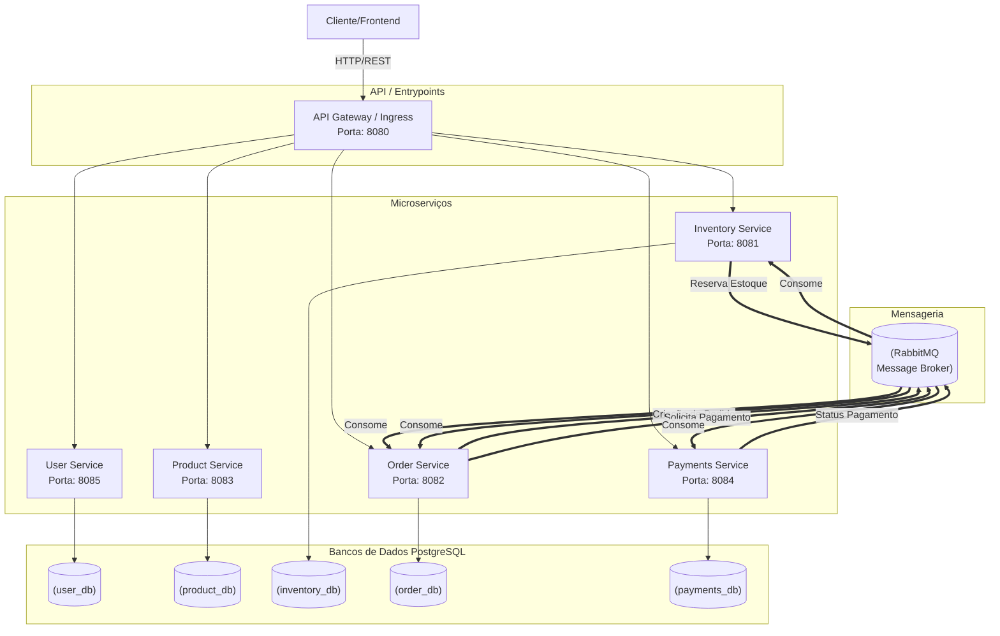

<div align="center">

# 🛒 E-commerce Microserviços

### Ecossistema Escalável com Spring Boot, RabbitMQ e Arquitetura de Microserviços

[](https://www.oracle.com/java/)
[](https://spring.io/projects/spring-boot)
[](https://www.postgresql.org/)
[](https://www.docker.com/)
[](https://www.rabbitmq.com/)
[](https://jwt.io/)
[](https://swagger.io/)

> ✅ **Status:** 100% Concluído — Ecossistema totalmente operacional via mensageria RabbitMQ.

</div>

---

## 📸 Preview (Swagger UI)

<div align="center">
  
</div>

---

## 📌 Sobre o Projeto

Este projeto implementa um sistema de e-commerce robusto baseado em **microserviços independentes**, que se comunicam de forma assíncrona através de um Message Broker (**RabbitMQ/AMQP**). O objetivo principal é fornecer uma plataforma escalável, onde cada domínio (Usuários, Produtos, Inventário, Pedidos e Pagamentos) possui seu próprio ciclo de vida e banco de dados.

Construído com foco em **arquitetura moderna**, o projeto incorpora:

- ✅ **Comunicação Assíncrona** orientada a eventos com RabbitMQ.
- ✅ **API Gateway** centralizado para roteamento e segurança.
- ✅ **Service Discovery** com Netflix Eureka (implantação interna).
- ✅ **Segurança Distribuída** via JWT e Spring Security.
- ✅ **Isolamento de Dados** com um banco de dados PostgreSQL por serviço.
- ✅ **Containerização Completa** para orquestração simplificada.

---

## 🏛️ Arquitetura

### Visão Geral do Ecossistema



### Estrutura de Pastas

```
📦 meu-ecommerce-microservicos
 ├── 🔐 user/             # Autenticação e Gestão de Usuários (8085)
 ├── 📦 product/          # Catálogo e Categorias (8083)
 ├── 🏭 inventory/        # Controle de Estoque e SKU (8081)
 ├── 📝 order/            # Orquestração de Pedidos e Status (8082)
 ├── 💳 payments/         # Processamento Financeiro (8084)
 ├── 🌉 gateway/          # API Gateway (8080)
 └── 🐳 docker-compose.overview.yml
```

---

## 🚀 Endpoints Principais (Via Gateway :8080)

### 🔐 User Service
| Método | Endpoint | Descrição | Auth |
|--------|----------|-----------|------|
| `POST` | `/auth/register` | Cadastro de novo usuário | ❌ |
| `POST` | `/auth/login` | Login e geração de JWT | ❌ |
| `GET` | `/users/listAll` | Listagem paginada | ✅ |

### 📦 Product Service
| Método | Endpoint | Descrição | Auth |
|--------|----------|-----------|------|
| `GET` | `/products/listAll` | Catálogo completo | ❌ |
| `POST` | `/products` | Cadastro de produto | ✅ |
| `PUT` | `/products/id/{id}` | Atualização técnica | ✅ |

### 🏭 Inventory Service
| Método | Endpoint | Descrição | Auth |
|--------|----------|-----------|------|
| `GET` | `/inventory/listAll` | Visualizar estoque | ✅ |
| `PUT` | `/inventory/id/{id}` | Ajustar quantidades | ✅ |

### 📝 Order Service
| Método | Endpoint | Descrição | Auth |
|--------|----------|-----------|------|
| `POST` | `/orders` | Iniciar fluxo de compra | ✅ |
| `GET` | `/orders/id/{id}` | Consultar status | ✅ |

---

## 🔐 Segurança e Fluxo

A segurança é centralizada no **API Gateway**, que utiliza **JWT (JSON Web Token)** para validar as requisições antes de encaminhá-las aos serviços internos.

1. **Autenticação:** O `User Service` valida as credenciais e emite o token.
2. **Autorização:** O Gateway verifica a validade do token e as permissões (Roles).
3. **Comunicação Interna:** Os serviços utilizam mensageria para operações críticas, garantindo integridade sem expor endpoints de processamento sensíveis.

---

## 🧪 Testes

O projeto utiliza uma suíte de testes focada em estabilidade:

| Camada | Ferramenta | Objetivo |
|--------|------------|----------|
| **Unitários** | JUnit 5 + Mockito | Validação de regras de negócio em Services |
| **Integração** | MockMvc | Teste de contratos de API e roteamento |
| **Infra** | Actuator | Health checks e monitoramento de dependências |

```bash
# Executar testes em um módulo específico
mvn test -pl <nome-do-modulo>
```

---

## 🐳 Rodando com Docker (Completo)

A orquestração utiliza o Docker Compose para subir todo o ecossistema (Bancos + Broker + Apps).

**1. Iniciar a infraestrutura e serviços:**
```bash
docker-compose -f docker-compose.overview.yml up -d
```

**2. Verificar o status dos containers:**
```bash
docker ps
```

**Mapeamento de Portas:**
- **Gateway:** `8080` (Porta de entrada única)
- **RabbitMQ Management:** `15672` (guest/guest)
- **PostgreSQL:** `5432`

---

## 💻 Rodando Localmente (Desenvolvimento)

**Pré-requisitos:** Java 17+, Maven 3.8+, Docker.

```bash
# Clone e entre na pasta
git clone https://github.com/betolara1/meu-ecommerce-microservicos.git
cd meu-ecommerce-microservicos

# Inicie apenas os bancos e o broker
docker-compose -f docker-compose.overview.yml up -d db-user db-product db-inventory db-order db-payment rabbitmq

# Execute o serviço desejado (ex: Product)
cd product
./mvnw spring-boot:run
```

---

## 📊 Monitoramento e Documentação

### Swagger UI
Cada microserviço expõe sua própria documentação OpenAPI. Através do Gateway, você pode acessar:
- `http://localhost:8080/swagger-ui.html` (Roteado para o serviço configurado)

### Spring Actuator
Métricas e saúde disponíveis em cada serviço no path `/actuator/health`.

---

## 🛠️ Stack Tecnológica

| Tecnologia | Versão | Finalidade |
|-----------|--------|------------|
| Java | 17 | Linguagem base |
| Spring Boot | 3.5.8 | Framework principal |
| RabbitMQ | 3.12+ | Mensageria e AMQP |
| Spring Cloud Gateway | — | Gateway e Roteamento |
| PostgreSQL | 15/Latest | Persistência de dados |
| Hibernate/JPA | — | ORM |
| Spring Security + JWT | — | Segurança distribuída |
| Netflix Eureka | — | Service Discovery |
| Docker + Compose | — | Orquestração |

---

## 👨‍💻 Autor

Desenvolvido por **Roberto Lara** — Backend Developer specializing in Microservices.

[](https://github.com/betolara1)

---

<div align="center">

**E-commerce Microserviços** — Arquitetura de ponta para aplicações escaláveis.

</div>