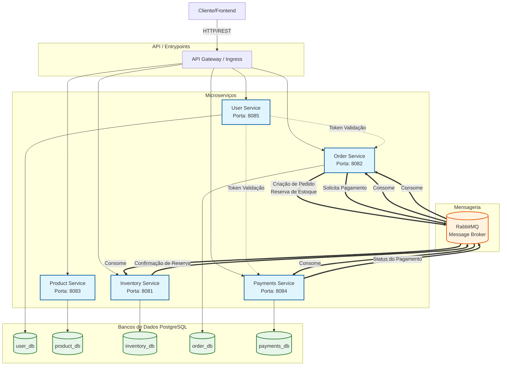
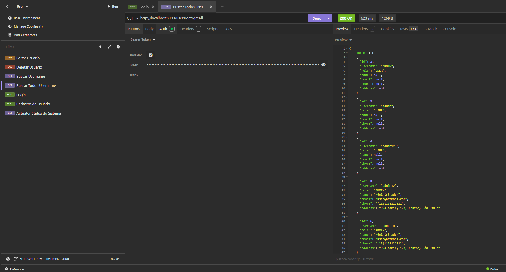
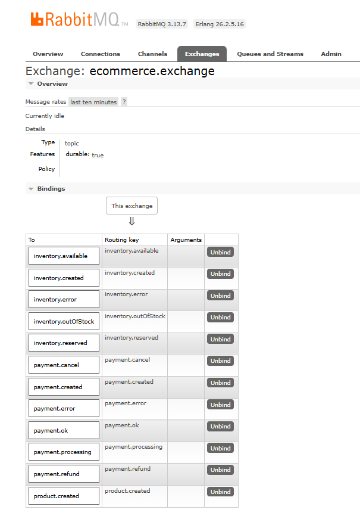

# 🛒 E-commerce Microserviços

Um projeto de e-commerce desenvolvido com **Spring Boot 3.5.8** e **Java 17**, utilizando arquitetura de **microserviços** para aprender e praticar várias funcionalidades avançadas do Spring Boot.

> ✅ **Status:** 100% Concluído — O ecossistema integrado (Gateway, Eureka e as APIs) foi finalizado, validado e está totalmente operacional via mensageria RabbitMQ.

## 📋 Sobre o Projeto

Este projeto implementa um sistema de e-commerce com múltiplos microserviços independentes que se comunicam através de **mensageria (RabbitMQ/AMQP)**. O objetivo é explorar e consolidar conhecimentos em:

- ✅ Spring Boot (Web, Data JPA, AMQP)
- ✅ Arquitetura de Microserviços
- ✅ Docker & Docker Compose
- ✅ Mensageria (RabbitMQ)
- ✅ Bancos de Dados Relacionais
- ✅ API REST
- ✅ Containerização com Docker

### 💡 Funcionalidades Principais
- **Cadastro e Autenticação:** Gestão e autorização de usuários com JWT.
- **Catálogo de Produtos:** CRUD completo de produtos, categorias e preços.
- **Controle de Estoque:** Verificação e baixa de inventário.
- **Pedidos:** Processamento do carrinho e criação de pedidos.
- **Pagamentos:** Simulação e processamento de transações financeiras.

## 🏗️ Arquitetura



O projeto está organizado em cinco microserviços principais:

```
meu-ecommerce-microservicos/
├── user/           → Serviço de Autenticação e Usuários
├── product/        → Serviço de Produtos
├── inventory/      → Serviço de Inventário
├── order/          → Serviço de Pedidos
├── payments/       → Serviço de Pagamentos
└── docker-compose.overview.yml
```

### 📦 Microserviços

#### **User (Autenticação e Usuários)**
- **Porta:** 8085
- **Descrição:** Autenticação (JWT, Login, Registro), gestão de usuários
- **Java Version:** 21 (Docker runtime) / 17 (Source)
- **Dependências principais:** Spring Data JPA, Spring Security, JWT, Swagger, Actuator
- **Status:** ✅ Concluído (Padrão Ouro M1)
- **Banco de Dados:** PostgreSQL (user_db)

#### **Product (Produtos)**
- **Porta:** 8083
- **Descrição:** CRUD de produtos, categorias e controle de preços
- **Java Version:** 21 (Docker runtime) / 17 (Source)
- **Dependências principais:** Spring Data JPA, Spring Web, Feign Client, Swagger, Actuator
- **Status:** ✅ Concluído (Padrão Ouro M1)
- **Banco de Dados:** PostgreSQL (product_db)

#### **Inventory (Inventário)**
- **Porta:** 8081
- **Descrição:** Verifica disponibilidade, reserva e controle de estoque de produtos
- **Java Version:** 21 (Docker runtime) / 17 (Source)
- **Dependências principais:** Spring Data JPA, Spring Web, Feign Client, Swagger, Actuator
- **Status:** ✅ Concluído (Padrão Ouro M1)
- **Banco de Dados:** PostgreSQL (inventory_db)

#### **Order (Pedidos)**
- **Porta:** 8082
- **Descrição:** Recebe pedidos, gerencia status da compra e histórico de transações
- **Java Version:** 21 (Docker runtime) / 17 (Source)
- **Dependências principais:** Spring Data JPA, Spring Web, Feign Client, Swagger, Actuator
- **Status:** ✅ Concluído (Padrão Ouro M1)
- **Banco de Dados:** PostgreSQL (order_db)

#### **Payments (Pagamentos)**
- **Porta:** 8084
- **Descrição:** Processamento de transações financeiras e gestão de pagamentos
- **Java Version:** 21 (Docker runtime) / 17 (Source)
- **Dependências principais:** Spring Data JPA, Spring Web, Feign Client, Swagger, Actuator
- **Status:** ✅ Concluído (Padrão Ouro M1)
- **Banco de Dados:** PostgreSQL (payments_db)

## 🔧 Tecnologias Utilizadas

- **Java 17**
- **Spring Boot 3.5.8**
  - Spring Boot Starter Web
  - Spring Boot Starter Data JPA
  - Spring Boot Starter AMQP
  - Spring Boot Starter Security (User Service)
  - Spring Boot DevTools
  - Spring Boot Docker Compose
- **Banco de Dados:** PostgreSQL (5 databases separados)
- **Docker & Docker Compose**
- **RabbitMQ** (Mensageria AMQP)
- **Maven** (Build & Dependency Management)
- **Spring Security** (Autenticação e Autorização)

## 🚀 Como Executar

### Pré-requisitos

- Java 17+
- Docker & Docker Compose
- Maven 3.6+ (ou usar `mvnw`)

### 1. Clonar o Repositório

```bash
git clone https://github.com/betolara1/meu-ecommerce-microservicos.git
cd meu-ecommerce-microservicos
```

### 2. Iniciar os Serviços com Docker Compose

A arquitetura usa `docker-compose.overview.yml` que agrupa todos os serviços:

```bash
docker-compose -f docker-compose.overview.yml up -d
```

Isso iniciará:
- ✅ PostgreSQL (5 databases separados)
- ✅ RabbitMQ (message broker)
- ✅ User Service (8080)
- ✅ Inventory Service (8081)
- ✅ Order Service (8082)
- ✅ Product Service (8083)
- ✅ Payments Service (8084)

**Status:** ✅ Docker Compose 100% funcional com os 5 microserviços e bancos independentes. 🐳

### 3. Executar Localmente (Desenvolvimento)

Para cada microserviço:

```bash
cd <microservico>
./mvnw spring-boot:run
```

Ou com Maven instalado:

```bash
mvn spring-boot:run
```

## 📡 Comunicação Entre Serviços

Os microserviços se comunicam através de **filas RabbitMQ (AMQP)**:

```
User Service (8085) → [Autenticação]
Product Service (8083) → [Catálogo de Produtos]
Inventory Service (8081) ← [Verificar Estoque]
Order Service (8082) → [Criar Pedidos] → Inventory Service
                      → [Confirmar Pedido] → Payments Service
Payments Service (8084) → [Processar Transação] → Order Service
                       → [Confirmação de Pagamento] → RabbitMQ
```

## 🔄 Fluxo de Funcionamento

### 1. Registro e Autenticação do Usuário
```
Cliente → POST /auth/register → User Service (8085)
        ↓
        User Service valida, criptografa senha e armazena no PostgreSQL
        ↓
        Retorna dados do usuário (sem senha)
```

### 2. Consulta de Produtos
```
Cliente → GET /products → Product Service (8083)
        ↓
        Product Service retorna lista de produtos disponíveis
```

### 3. Criação de Pedido
```
Cliente → POST /order → Order Service (8082)
        ↓
        Order Service cria pedido e envia mensagem para:
        ├─ Inventory Service (8081) - Verificar e reservar estoque
        └─ Payments Service (8084) - Aguardar confirmação
        ↓
        Se aprovado, pedido é confirmado
```

### 4. Processamento de Pagamento
```
Order Service → Mensagem RabbitMQ → Payments Service (8084)
                                    ↓
                                    Processa transação
                                    ↓
                                    Retorna confirmação via RabbitMQ
                                    ↓
Order Service recebe confirmação → Atualiza status do pedido
```

## 🔒 Segurança

O projeto foca fortemente em boas práticas de mercado para rotas e dados sensíveis:
- **JWT (JSON Web Token):** Utilizado para autenticação e proteção de endpoints privados (ex: atualizações e exclusões).
- **Criptografia BCrypt:** Senhas de usuários são tratadas e salvas de forma segura no banco de dados.
- **Autorização via Header:** As rotas protegidas validam o token passado no cabeçalho `Authorization: Bearer <token>`.
- **Controle de Acesso:** Permissões estruturadas (Roles) e restrição para endpoints críticos.

## 🗂️ Estrutura de Projeto

Cada microserviço segue a seguinte estrutura:

```
microservico/
├── src/
│   ├── main/
│   │   ├── java/com/betolara1/<service>/
│   │   │   ├── <Service>Application.java
│   │   │   ├── controller/
│   │   │   ├── service/
│   │   │   ├── model/
│   │   │   ├── repository/
│   │   │   └── dto/
│   │   └── resources/
│   │       └── application.properties
│   └── test/
│       └── java/com/betolara1/<service>/
├── pom.xml
├── mvnw
└── compose.yaml
```

## 🔗 Endpoints Disponíveis

> 🚪 **Acesso via API Gateway:** Todas as requisições externas devem ser direcionadas unicamente para o **Gateway na porta `8080`** (`http://localhost:8080/...`). O Gateway fará o roteamento automático para os respectivos microserviços. As portas listadas abaixo representam apenas onde cada serviço opera internamente.

### User Service (Porta Interna: 8085) - Autenticação e Usuários


- `POST /auth/register` - Registrar novo usuário
- `POST /auth/login` - Fazer login
- `GET /users/listAll` - Listar usuários com paginação
- `GET /users/{identifier}` - Buscar perfil de usuário por ID numérico ou Username (protegido)
- `PUT /users/{id}` - Atualizar dados do usuário (protegido)
- `DELETE /users/{id}` - Excluir usuário (protegido)

### Product Service (Porta Interna: 8083)


- `GET /products/listAll` - Listar todos os produtos (paginado)
- `GET /products/{identifier}` - Buscar produto por ID ou Nome exato
- `GET /products/category/{categoryId}` - Buscar produtos por ID da categoria
- `GET /products/active/{active}` - Buscar produtos por status (ativo/inativo)
- `POST /products` - Criar novo produto
- `PUT /products/id/{id}` - Atualizar produto existente
- `DELETE /products/id/{id}` - Deletar produto logicamente

### Inventory Service (Porta Interna: 8081)


- `GET /inventory/listAll` - Listar todo o inventário (paginado)
- `GET /inventory/status/{status}` - Buscar inventário por status (AVAILABLE, OUT_OF_STOCK)
- `GET /inventory/id/{id}` - Buscar item específico por ID
- `GET /inventory/sku/{sku}` - Buscar item por SKU
- `POST /inventory` - Criar novo item de inventário
- `PUT /inventory/id/{id}` - Atualizar quantidade em estoque
- `DELETE /inventory/id/{id}` - Remover item do inventário logicamente

### Order Service (Porta Interna: 8082)


- `GET /orders/listAll` - Listar todos os pedidos (paginado)
- `GET /orders/customerId/{customerId}` - Buscar pedidos de um cliente
- `GET /orders/status/{status}` - Buscar pedidos por status
- `GET /orders/orderDate/{orderDate}` - Buscar pedidos por data (YYYY-MM-DD)
- `GET /orders/id/{id}` - Buscar pedido específico
- `POST /orders` - Criar novo pedido
- `PUT /orders/id/{id}` - Atualizar status do pedido
- `DELETE /orders/id/{id}` - Cancelar pedido logicamente

### Payments Service (Porta Interna: 8084)


- `GET /payments/listAll` - Listar todos os pagamentos (paginado)
- `GET /payments/status/{status}` - Buscar pagamentos por status
- `GET /payments/paymentMethod/{paymentMethod}` - Buscar pagamentos por método (CREDIT_CARD, PIX, etc)
- `GET /payments/id/{id}` - Buscar pagamento pelo seu ID interno
- `GET /payments/orderId/{orderId}` - Buscar pagamento de um pedido específico
- `GET /payments/transactionId/{transactionId}` - Buscar pagamento pelo ID da transação externa
- `POST /payments` - Processar novo pagamento
- `PUT /payments/id/{id}` - Atualizar status do pagamento
- `DELETE /payments/id/{id}` - Cancelar pagamento logicamente

## 📝 Configuração

Cada microserviço possui seu arquivo `application.properties` com as seguintes configurações padrão:

```properties
# User Service
spring.application.name=user
server.port=8085
spring.datasource.url=jdbc:postgresql://localhost:5432/user_db
spring.datasource.username=postgres
spring.datasource.password=root
```

```properties
# Product Service
spring.application.name=Product
server.port=8083
spring.datasource.url=jdbc:postgresql://localhost:5432/product_db
spring.datasource.username=postgres
spring.datasource.password=root
```

```properties
# Inventory Service
spring.application.name=inventory
server.port=8081
spring.datasource.url=jdbc:postgresql://localhost:5432/inventory_db
spring.datasource.username=postgres
spring.datasource.password=root
```

```properties
# Order Service
spring.application.name=order
server.port=8082
spring.datasource.url=jdbc:postgresql://localhost:5432/order_db
spring.datasource.username=postgres
spring.datasource.password=root
```

```properties
# Payments Service
spring.application.name=Payments
server.port=8084
spring.datasource.url=jdbc:postgresql://localhost:5432/payments_db
spring.datasource.username=postgres
spring.datasource.password=root
```

### Configuração RabbitMQ (comum a todos)

```properties
spring.rabbitmq.host=localhost
spring.rabbitmq.port=5672
spring.rabbitmq.username=guest
spring.rabbitmq.password=guest

spring.jpa.show-sql=true
spring.jpa.properties.hibernate.format_sql=true
spring.jpa.hibernate.ddl-auto=update
```

## 🧪 Testes

Para executar os testes de um microserviço:

```bash
cd <microservico>
./mvnw test
```

Ou com Maven:

```bash
mvn test
```

## 🧪 Testando a API

> 💡 **Nota:** Todos os exemplos abaixo apontam para o **API Gateway remoto na porta `8080`**, que atua como ponto de entrada único e roteia a requisição de forma transparente para o microserviço correspondente.

### Usando cURL

#### 1. Registrar novo usuário
```bash
curl -X POST http://localhost:8080/auth/register \
  -H "Content-Type: application/json" \
  -d '{"username":"usuario@email.com","password":"senha123"}'
```

#### 2. Login
```bash
curl -X POST http://localhost:8080/auth/login \
  -H "Content-Type: application/json" \
  -d '{"username":"usuario@email.com","password":"senha123"}'
```

#### 3. Listar produtos
```bash
curl -X GET http://localhost:8080/products
```

#### 4. Criar novo produto
```bash
curl -X POST http://localhost:8080products \
  -H "Content-Type: application/json" \
  -d '{
    "name":"Produto Test",
    "price":99.99,
    "category":"Eletrônicos",
    "description":"Descrição do produto"
  }'
```

#### 5. Criar pedido
```bash
curl -X POST http://localhost:8080/order \
  -H "Content-Type: application/json" \
  -d '{
    "userId":1,
    "productId":1,
    "quantity":2,
    "totalPrice":199.98
  }'
```

### Usando Postman ou Insomnia



Você pode importar os endpoints no Postman/Insomnia para testes mais completos. Crie uma coleção com as requisições acima e teste os fluxos completos.

### Verificando RabbitMQ



Acesse a interface web do RabbitMQ:
```
http://localhost:15672
# Padrão: guest / guest
```

## 📚 Aprendizados

Este projeto foi criado para consolidar conhecimentos em:

- [x] Spring Boot Web (REST APIs)
- [x] Spring Data JPA (Persistência de dados)
- [x] Docker & Containerização (Multi-stage com Maven Wrapper)
- [x] Padrões de Design (DTO Request/Response, Repository, Service)
- [x] Tratamento Global de Exceções (ControllerAdvice + ValidationErrorDTO)
- [x] Segurança e Tokens (Spring Security OAuth2 + JWT)
- [x] Boas práticas em Entidades (BigDecimal, Validação de Dados, camelCase fixado)
- [x] OpenAPI (Swagger) em todos os serviços
- [x] Paginação e Updates Parciais (null check)
- [x] Comunicação Assíncrona via RabbitMQ
- [x] Testes Unitários e de Integração

## 🏆 Conquistas do Projeto (Finalizado)

- [x] Desenvolvimento de microserviços especializados (Product, User, Payments, Order, Inventory)
- [x] Refatoração robusta para melhores práticas e padrão de excelência (M1)
- [x] Orquestração completa de ponta a ponta com Docker Compose
- [x] Construção de arquitetura impulsionada por fila/mensageria com RabbitMQ
- [x] Roteamento e autorização centralizada via API Gateway
- [x] Service Discovery automatizado com Eureka Server
- [x] Sistema de Autenticação universal distribuída (JWT)
- [x] Swagger/OpenAPI universal
- [x] Métricas com Spring Actuator (Visão para Prometheus, Jaeger, etc.)
- [x] Rotinas rigorosas de infra e builds testados automatizados

## ⚠️ Troubleshooting

### MAPEAMENTO DE PORTAS CORRETO

| Serviço | Porta | Função |
|---------|-------|--------|
| **API Gateway** | `8080` | Gateway |
| **User Service** | `8085` | Autenticação |
| **Inventory Service** | `8081` | Estoque |
| **Order Service** | `8082` | Pedidos |
| **Product Service** | `8083` | Produtos |
| **Payments Service** | `8084` | Pagamentos |
| **RabbitMQ** | `5672` | Mensageria |
| **RabbitMQ Management** | `15672` | Web UI |

### Problema: Portas já em uso
```bash
# Encontrar processo usando porta (exemplo: 8080)
netstat -ano | findstr :8080

# Encerrar processo (substituir PID)
taskkill /PID <PID> /F
```

### Problema: Banco de dados não conecta
- Verificar se PostgreSQL está rodando nos containers
- Verificar credenciais em application.properties
- Verificar se o banco de dados existe

### Problema: RabbitMQ não conecta
- Verificar se RabbitMQ está rodando em `localhost:5672`
- Verificar credenciais padrão: `guest/guest`
- Acessar interface web em `http://localhost:15672`

### Limpar e reiniciar tudo
```bash
# Parar todos os containers
docker-compose -f docker-compose.overview.yml down

# Remover volumes (limpar dados)
docker-compose -f docker-compose.overview.yml down -v

# Limpar sistema
docker system prune -f

# Criar a Network de conexão local entre os microserviços
docker network create ecommerce-network

# Reiniciar
docker-compose -f docker-compose.overview.yml up -d
```

### 📊 Scripts de Diagnóstico

**Windows PowerShell:**
```powershell
.\diagnostico.ps1
```

Este script verifica:
- ✅ Status de todos os containers
- ✅ Conectividade em cada porta
- ✅ Endpoints HTTP respondendo
- ✅ Teste de registro de usuário
- ✅ Diagnóstico completo do sistema

### 📄 Documentos de Referência

- **DIAGNOSTICO_CONEXAO.md** - Análise completa dos problemas encontrados
- **SWAGGER_GUIDE.md** - Guia completo sobre Swagger/OpenAPI

## 📊 Informações do Projeto

- **Arquitetura:** Microserviços com comunicação assíncrona via RabbitMQ
- **Padrões utilizados:** Repository, Service, DTO, REST
- **Segurança:** Spring Security com criptografia de senhas
- **Escalabilidade:** Preparado para crescimento com múltiplos bancos de dados
- **Containerização:** 100% dockerizado com compose

## 📖 Referências

- [Spring Boot Documentation](https://spring.io/projects/spring-boot)
- [Spring AMQP](https://spring.io/projects/spring-amqp)
- [Spring Security](https://spring.io/projects/spring-security)
- [Spring Data JPA](https://spring.io/projects/spring-data-jpa)
- [Docker Documentation](https://docs.docker.com/)
- [Docker Compose](https://docs.docker.com/compose/)
- [RabbitMQ Tutorial](https://www.rabbitmq.com/getstarted.html)
- [PostgreSQL Documentation](https://www.postgresql.org/docs/)
- [Microservices Patterns](https://microservices.io/patterns/)

## 👨‍💻 Autor

**Roberto Lara**

## 📄 Licença

Projeto de aprendizado pessoal.

---

**Última atualização:** Março de 2026  
**Status:** ✅ **PROJETO 100% CONCLUÍDO** | E-commerce escalável totalmente finalizado. API Gateway, Service Discovery, Segurança JWT e Mensageria RabbitMQ implantados e integrados através de containers Docker. Missão cumprida! 🚀